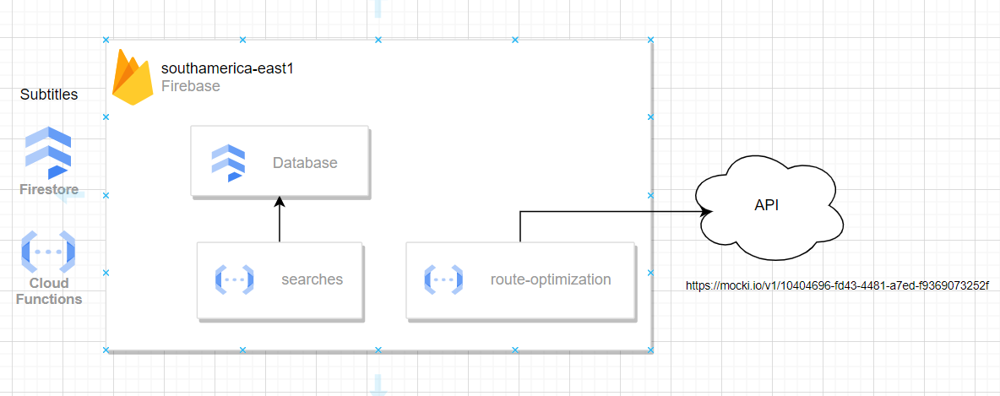

# ateliware-tech-assessment

> Monorepo for engineering tech assessment for Ateliware [See about challenge here.](https://communication-assets.gupy.io/production/companies/44084/emails/1687282449394/9ff97070-9cbd-11ed-b349-6b03aae20a37/engineering_tech_assessment_2023_en.pdf)

# [Live Preview](https://ateliware-tech-assessment.web.app/)

### Stack

##### Backend

On folder backend/{function_name}, you'll find some instructions for execute it.

- Nodejs 18
- Typescript
- Express
- Google Cloud Functions
- Google Cloud Firestore

##### Frontend (web-app)

On folder web-app, you'll find some instructions for execute it.

- Vite
- Vue 3
- Vuetify
- Firebase Hosting

### Architeture

### Improvements TO DO

- [ ] Fix rewriting hosting settings to redirect to API for Security improvements. (hide api domain)
- [ ] Responsive Chessboard for mobile

### Insights

With all the data from the survey, we can do an analysis using the heat map to find out which are the most frequent routes.
In this way, we can suggest: 
 - interesting locations for a small distribution center.
 - charging stations to recharge drone batteries.
 - Implement a predetermined flight path network to optimize delivery time.
 - Use another drone to centered packages to a distribution center.

